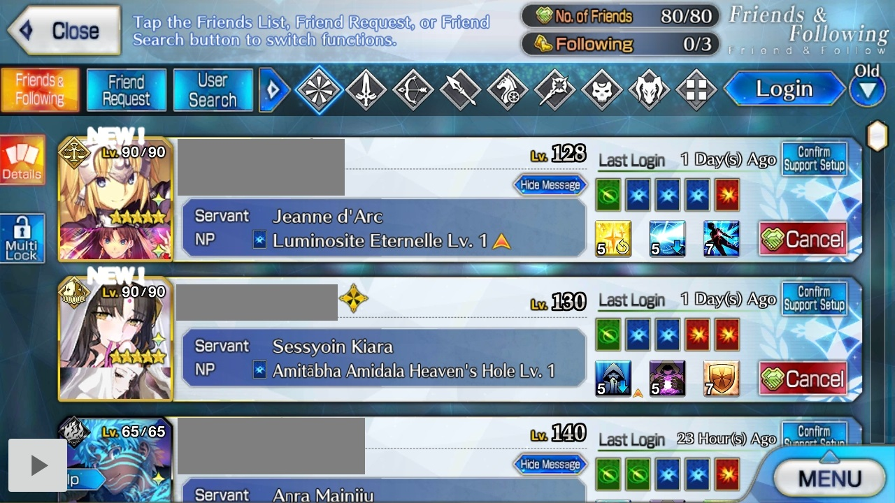

## How FGO should look

For FGA to work, FGO should be centered on your phone's screen excluding notch (hole on screen for front camera)

This is what your phone should look like:

1. If it's 16:9, there's nothing to worry about.

   

2. Not 16:9, no notch. FGO should be centered on screen. The borders around FGO should be blue in such cases.

   

3. Not 16:9, but has a notch. FGO should be centered in the area exluding notch. The borders around FGO should be blue excluding the notch region which should be black.

   

## FGO looks different on my phone

Multiple cases may apply to your phone.

### CASE 1: Borders around FGO are black

lorem ipsum

### CASE 2: Your phone has a notch, but the blue borders of FGO extend over the notch

Turn ON `Ignore Notch calculation` in `More options`.

### CASE 3: Your phone in Android 8 and has a notch

Notch detection is only possible on Android 9 and above. Either update your phone or find a way to disable notch in your phone's settings.

I've only seen a single case (Sharp Aquos C10 SH-Z01) of this upto now but I think the user wasn't able to find a solution.

