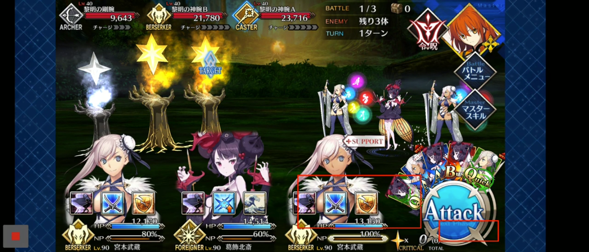

## How FGO should look on JP/KR (wide-screen update)

Should fill the entire screen including the notch. There should be no black bars on the screen.

## How FGO should look

For FGA to work, FGO should be centered on your phone's screen excluding notch (hole on screen for front camera)

This is what your phone should look like:

1. If it's 16:9, there's nothing to worry about.

   

2. Not 16:9, no notch. FGO should be centered on screen. The borders around FGO should be blue in such cases.

   

3. Not 16:9, but has a notch. FGO should be centered in the area exluding notch. The borders around FGO should be blue excluding the notch region which should be black.

   

If your phone has a notch and FGO looks like in (2), turn ON Ignore Notch calculation.

## FGO looks different on my phone

Multiple cases may apply to your phone.

### CASE 1: Borders around FGO are black

If FGO is centred on the screen, even if the borders are black, then it might work as it is. If this is case and your phone has a notch, turn ON 'Ignore Notch calculation'.

Otherwise, you'll have to make FGO a full-screen app.  
Only if that doesn't work, check if you can make FGA full-screen too.

For example, this won't work:  

#### Samsung phones
- Open `Settings` app.
- Search for and select `Full screen apps`.
- Turn ON the switch for FGO.

#### Huawei phones
- Open `Settings` app.
- Go to `Display & brightness > More display settings > Full-Screen Display`.
- Turn ON the switch for FGO.

#### Xperia phones

NA works fine but JP has this problem. I haven't found any Full-screen app setting on them yet, so right now there's no fix for this to my knowledge.  
For example, Sony Xperia 10 [#269](https://github.com/MathewSachin/Fate-Grand-Automata/issues/269):

### CASE 2: Your phone has a notch, but the blue borders of FGO extend over the notch

Turn ON `Ignore Notch calculation` in `More options`.

This was the case with Samsung phones before a OneUI update. You might have to do this if you're still on an older version of OneUI.

### CASE 3: Your phone has borders around FGO even at the bottom of screen

- LGv60 [#250](https://github.com/MathewSachin/Fate-Grand-Automata/issues/250). The user had to turn OFF gestures to remove that black bar at the bottom of the screen.
  
  

- Google Pixel 4L [#337](https://github.com/MathewSachin/Fate-Grand-Automata/issues/337). There are black strips on 3 sides of FGO, but the user didn't respond yet in this case so I don't know if they found a way to turn them OFF.

  

### CASE 4: Your phone is Android 7 or 8 and has a notch

Notch detection is only possible on Android 9 and above. Either update your phone or find a way to disable notch in your phone's settings.

I don't have any solutions here. If you're a programmer you can fork the code and tweak the regions I guess.

These are some phones that fall into this category:
- Sharp Aquos C10 (SH-Z01) [GP#1061](https://community.gamepress.gg/t/automatic-farming-app-fate-grand-automata/72155/1061)
- Huawei Y7 [#482](https://github.com/MathewSachin/Fate-Grand-Automata/issues/482)
- LG G7 [#455](https://github.com/MathewSachin/Fate-Grand-Automata/issues/455) **JUST UPDATE YOUR ANDROID VERSION**
- Oukitel u18 [#373](https://github.com/MathewSachin/Fate-Grand-Automata/issues/373)

