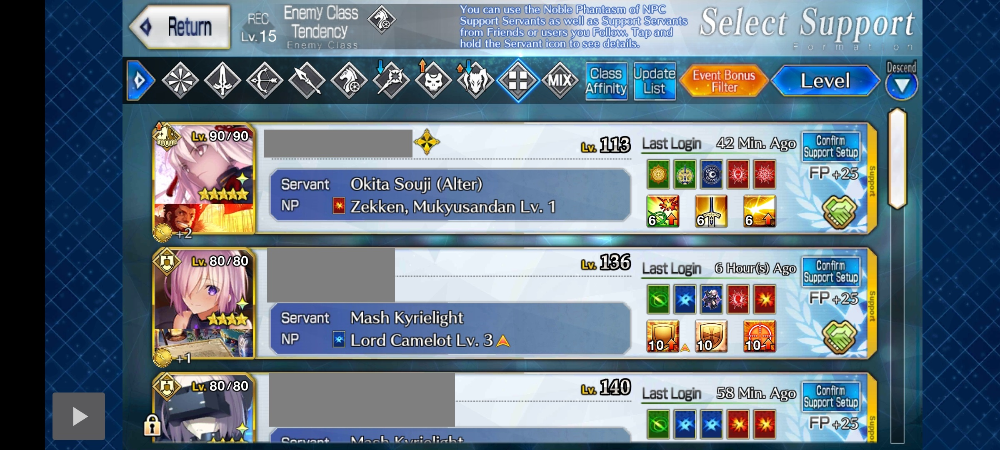
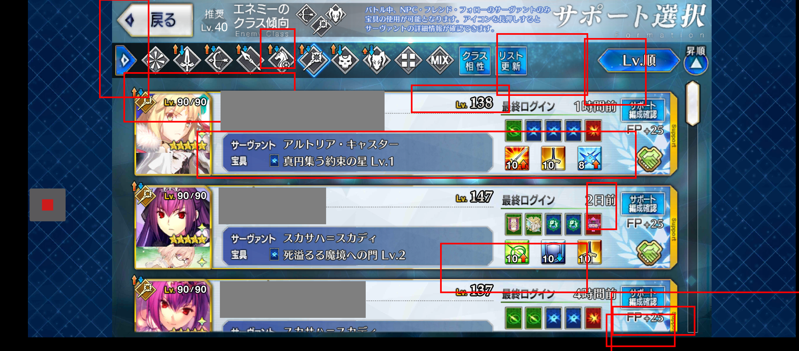

## How FGO should look on JP/KR (wide-screen update)

Should fill the entire screen including the notch.

There should be no black bars on the screen. If there are, switch your phone from Gesture Navigation to 3-button navigation.

## How FGO should look

For FGA to work, FGO should be centered on your phone's screen excluding notch (hole on screen for front camera)

This is what your phone should look like:

16:9                                   | Not 16:9, no notch                                                    | Not 16:9, has notch 
---------------------------------------|-----------------------------------------------------------------------|-------------------------------------------------------------------------------------------------
FGO should fill the entire screen      | FGO should be centered on screen with blue borders (no black borders) | FGO should be centered in the area exluding notch with blue borders. Notch area should be black.
 |                      | 

## When to use Ignore notch calculation?
If your phone has a notch, but the notch area is also filled by blue borders, turn ON `Ignore Notch calculation`.

**NOTE:** `Ignore notch calculation` is NOT needed on servers with the wide-screen update (JP/KR).

## FGO looks different on my phone

### CASE 1: Borders around FGO are black

If FGO is centred on the screen, even if the borders are black, then it might work as it is. If this is case and your phone has a notch, turn ON 'Ignore Notch calculation'.

Otherwise, you'll have to make FGO a full-screen app.  
Only if that doesn't work, check if you can make FGA full-screen too.

For example, this won't work:  

<table>
  <tr>
    <th>Samsung</th>
    <th>Huawei</th>
  </tr>
  <tr>
    <td>
      <ul>
        <li>Open <em>Settings</em> app</li>
        <li>Search for and select <em>Full screen apps</em></li>
        <li>Turn ON the switch for FGO</li>
      </ul>
    </td>
    <td>
      <ul>
        <li>Open <em>Settings</em> app</li>
        <li>Go to <em>Display & brightness > More display settings > Full-Screen Display</em></li>
        <li>Turn ON the switch for FGO</li>
      </ul>
    </td>
  </tr>
</table>

### CASE 2: Your phone has borders around FGO even at the bottom of screen

LGv60                                  | Google Pixel 4L
---------------------------------------|-----------------------
 | 

The black border are for gesture navigation.

To get rid of them:
- Go to `Settings > System > Gestures > System Navigation`.
- Change to `3-button navigation`.

### CASE 3: Your phone is Android 7 or 8 and has a notch

Notch detection is only possible on Android 9 and above. Either update your phone or find a way to disable notch in your phone's settings.