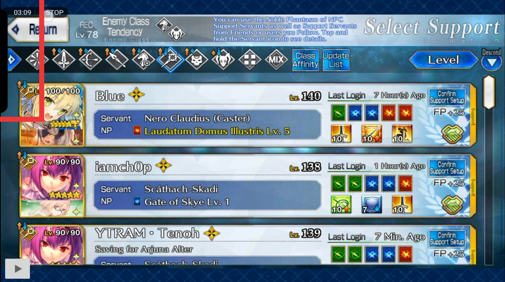
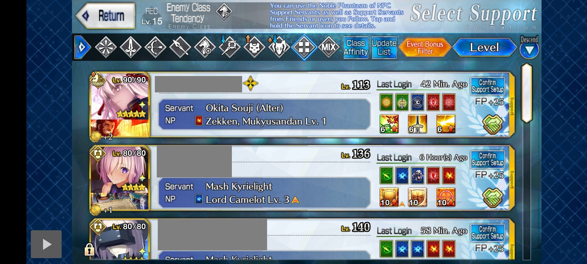
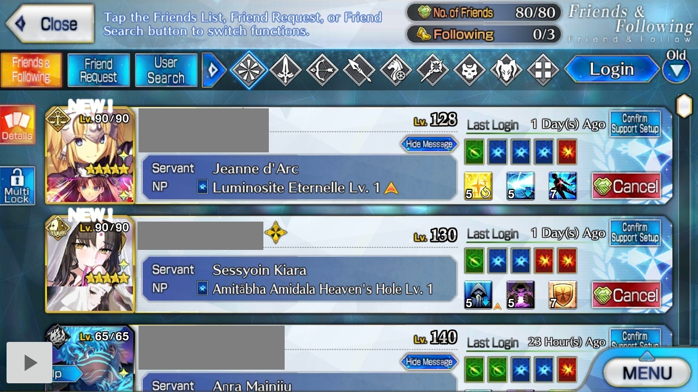

## Why can't I find it on PlayStore?
~~The app was unlisted until proper JP support.~~ See [#616](https://github.com/Fate-Grand-Automata/FGA/issues/616).  
It won't be made available on PlayStore again. You can download it from the link on the README page.

## Why does it show an error when installing?
Your phone/emulator should be Android 7 or later to use the app.  
The latest version of Nox doesn't work.

## Can't find 'Script Mode' option?
The app automatically detects which script can be run on the current screen.  
It will show the relevant option when you click on the PLAY button.

## Having trouble on Emulators?

See [Running on Emulators](Running-on-Emulators)

# IMPORTANT: Make sure the game looks as FGA wants it to

If you're having trouble, this is mostly related.
See [Game Area detection](Game-Area-detection)

## Can't start scripts (Mostly LG/Samsung phones)?

For LG:
Turn OFF Game Tools since it has the feature to prevent ALERTS from showing up.  
This prevents the dialog which lets you pick AutoSkill config from showing up.  
https://www.lg.com/us/support/help-library/lg-g7-thinq-gaming-tools-CT10000027-20150726480680

On other phones, if you have something like a Game Booster that blocks alerts from other apps when playing a game, turn it OFF.
Instructions would vary depending on your device, so Google.

## Worked before, doesn't work now

See [#314](https://github.com/Fate-Grand-Automata/FGA/issues/314)

## Keeps asking for Accessibility even after turning it ON

See [#314](https://github.com/Fate-Grand-Automata/FGA/issues/314)

## Uses skills on the wrong servant or doesn't use skills at all

Do you have skill confirmation ON in FGO?
If so, either turn that OFF or turn ON `More options/Skill confirmation in FGA.

## Not picking NP/cards on Attack screen OR Got stuck in some info screen

Is it just your phone lagging badly? If so, either get a new phone or try increasing the delays in `More options/Fine-tune`.

## Doesn't work on some screens

1. Check that you're not placing the PLAY button in a weird place.  
   See [Where should I place the PLAY button?](#where-should-i-place-the-play-button)

2. Is there some overlay on your phone/emulator screen that can screw up image matching?  
   For example:
   
   

## Where should I place the PLAY button?

If you have a non-16:9 phone, it is best to place the PLAY button outside FGO on the blue borders (until the wide-screen update).  
Bottom-left corner is ideal after the wide screen update.

If your phone is 16:9, the default placement at the bottom-left corner is ideal. While you can drag the button around to other places, there is a possibility of screwing things up if it comes in the way of image matching.  

